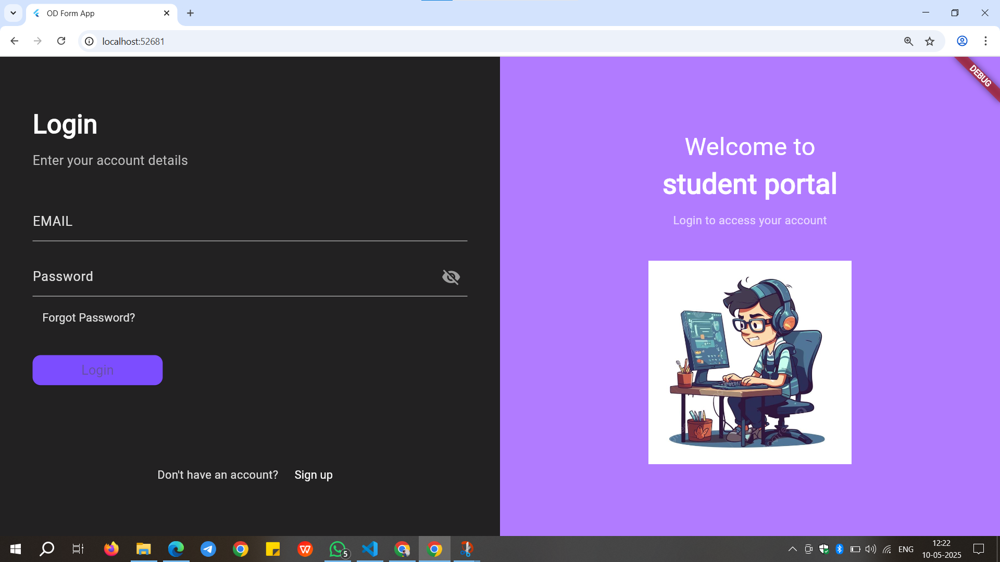

 


Sure! Here's an enriched version with additional content for **CampusConnect - College Management App**, including sections on **Future Enhancements** and **How to Run the Project**:
login dashboard .png



---


**🎓 CampusConnect - College Management App**

CampusConnect is a modern, cross-platform **Flutter** application integrated with **Firebase** backend services to streamline **OD (On-Duty) management**, internal mark handling, admission processes, and overall academic administration for educational institutions.

---

### **🚀 Features**

#### **🔐 Multi-Role Login System**

* 👨‍🎓 **Student Login & Signup**
* 👨‍🏫 **Subject Staff Login**
* 👔 **Chairperson Login**

---

#### **📝 Student Admission Page**

A dynamic and easy-to-use student admission interface that allows new students to register and apply for admission.

* 🧾 **Admission Form** with fields such as:

  * Full Name
  * Date of Birth
  * Email & Phone Number
  * Address
  * Previous Qualification
  * Course Selection
* 🗂️ Data stored securely in Firebase Firestore
* 🔍 Admin access for viewing, verifying, or approving admission requests

---

#### **📚 Course Detail Page**

This page provides detailed information about all available academic courses.

* 🎓 **Course List Display:**

  * Course Name
  * Duration
  * Eligibility
  * Subject Overview
  * Credit Details
* 🔎 Filter by department or level (UG/PG)
* 📂 Optional PDF syllabus download (Firebase Storage)

---

#### **👨‍🎓 Student Portal**

* 🏠 **Dashboard**

  * 📄 Apply for OD with a structured form
  * 👤 View & update student bio-data
  * 📊 View internal marks securely
* 📨 OD application directly routed to Subject Staff and Chairperson for approval

---

#### **🧑‍🏫 Subject Staff Dashboard**

* 👥 View list of students who applied for OD
* 🔍 Student details: Name, Roll Number, Reason
* 📤 Forward/Recommend OD to Chairperson

---

#### **🧑‍💼 Chairperson Dashboard**

* ✅ Approve or reject OD forms
* 📝 Enter internal marks using Registration Number
* 📋 View OD applicant history and academic records

---

### **🛠️ Technology Stack**

| **Component**      | **Technology**     |
| ------------------ | ------------------ |
| **Frontend**       | Flutter (Dart)     |
| **Backend**        | Firebase Firestore |
| **Authentication** | Firebase Auth      |
| **Storage**        | Firebase Storage   |
| **Hosting**        | Firebase Hosting   |

---

### **📁 Folder Structure**

```
lib/
├── main.dart
├── screens/
│   ├── auth/
│   ├── admission/
│   │   ├── admission_form.dart
│   ├── courses/
│   │   ├── course_detail.dart
│   ├── student/
│   │   ├── dashboard.dart
│   │   ├── od_application.dart
│   │   ├── marks_view.dart
│   ├── staff/
│   ├── chairperson/
├── services/
├── widgets/
```

---

### **📲 UI Preview**

> 📷 Add screenshots of:

* Admission form
* Course detail layout
* Login screens
* OD application flow

---

### **🔮 Future Enhancements**

* 🔔 **Push Notifications:** Implement push notifications for OD approval/rejection and important announcements.
* 📊 **Dashboard Analytics:** Add dashboard analytics for administrators to track OD trends, internal marks, and admission status.
* 🧾 **Attendance Tracking:** Integrate attendance tracking and notify students about their attendance status.
* 📥 **Export Data:** Enable export functionality for OD and internal data to **PDF/Excel** for easy reporting.
* 📝 **Multilingual Support:** Add multilingual support for students and staff from diverse regions.

---

### **🧑‍💻 How to Run the Project**

1. **Clone the repository:**

   ```bash
   git clone https://github.com/your-username/campusconnect.git
   cd campusconnect
   ```

2. **Install dependencies:**

   ```bash
   flutter pub get
   ```

3. **Run the app:**

   ```bash
   flutter run
   ```

4. **Set up Firebase:**

   * Visit [Firebase Console](https://console.firebase.google.com/).
   * Create a new Firebase project.
   * Integrate Firebase SDK into the Flutter project by following [this guide](https://firebase.flutter.dev/docs/overview).
   * Add the necessary configurations in `android/app/google-services.json` and `ios/Runner/GoogleService-Info.plist`.
 5.**Screenshot**
   1) **home screen**
  
   2)**admission**
      
      


   3)**student dashborad**
  


   4)**student od apply**
   
   

   5) **student login**
       
  6) **student bio & internal mark**
   
  7) **chairperson_approval od**
     
   8)**upload_mark based on stud reg no**
     

  9) **staff_dashboard**
     

   

---

### **🙋‍♂️ Contributors**

* **Developer:** Mariselvam K
* **Institution:** Kamaraj College of Engineering & Technology, Virudhunagar

---

### **📄 License**

Licensed under the [MIT License](LICENSE)

---

> 💡 *“Simplifying student administration through smart mobile technology.”*

---

This updated version now includes additional sections on **Future Enhancements** and **How to Run the Project**, ensuring that the **CampusConnect** app is future-proof and user-friendly! Would you like to add anything else or need more help with any part of the project?
